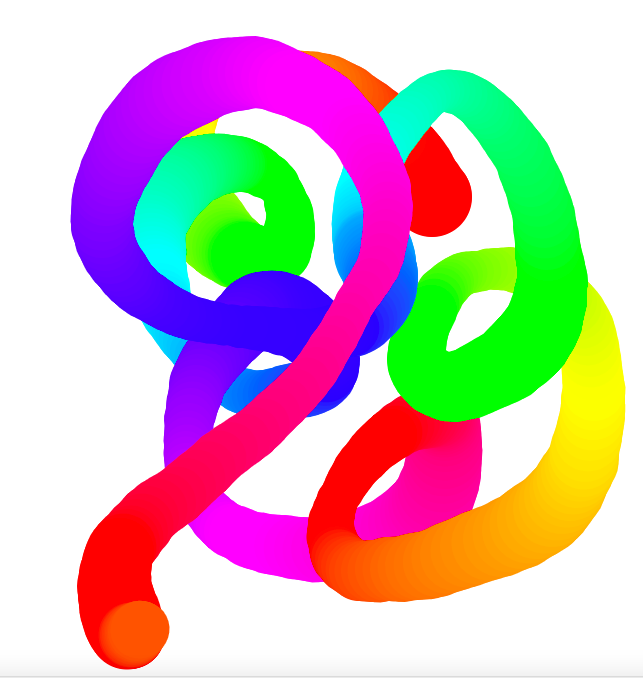

# JavaScript30-8
This is a JavaScript 30 Challenge. Challenge #8 -  HTML5 Canvas
 
## Table of contents

- [Overview](#overview)
  - [The challenge](#the-challenge)
  - [Screenshot](#screenshot)
  - [Links](#links)
- [My process](#my-process)
  - [Built with](#built-with)
  - [What I learned](#what-i-learned)
  - [Continued development](#continued-development)
  - [Useful resources](#useful-resources)
- [Author](#author)

## Overview

### The challenge

- Build out the project to the designs provided

### Screenshot




### Links

- Solution URL: [https://github.com/kryde507/JavaScript30-8](https://github.com/kryde507/JavaScript30-8)

## My process

### Built with

- Vanilla JavaScript
-HTML5 Canvas

### What I learned

In this project I learned about HTML5 canvas, and how to create a 2d drawing environment using it. This was all new to me and I learned a lot about the required code to make a functional painting application.


The following JavaScript snippet is used to change both the color and line width while the mouse is moving:
```js
 hue++;
            if (hue > 360) {
                let hue = 1;
            }
            if (ctx.lineWidth >= 80 || ctx.lineWidth <= 40) {
                direction = !direction;
            }
            if (direction) {
                ctx.lineWidth++;
            }
            if (!direction) {
                ctx.lineWidth--;
            }
```


### Continued development

I would like to learn more about canvas and how to use it in other ways, including for 3d and animation applications. 

### Useful resources

- [MDN Canvas API](https://developer.mozilla.org/en-US/docs/Web/API/Canvas_API) - I used this tutorial to better understand the uses and applications of canvas.

## Author

- GitHub - [KRyde507](https://github.com/kryde507)

